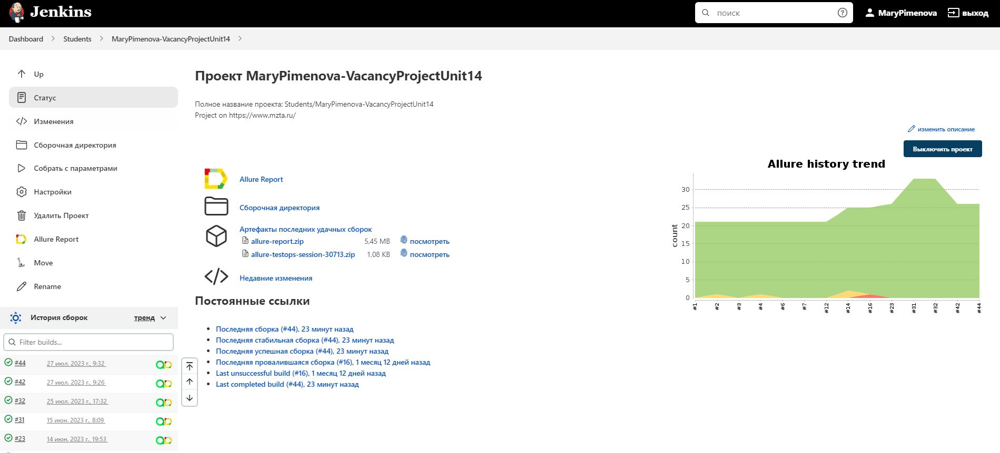
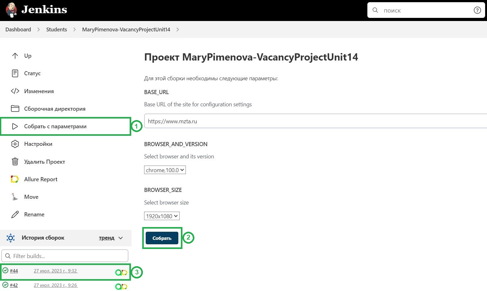
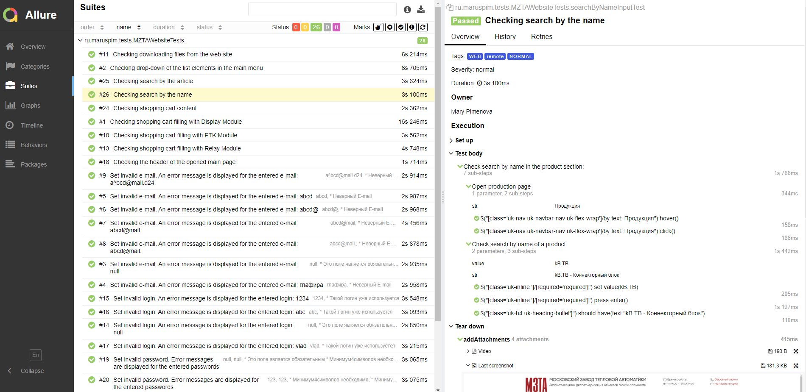
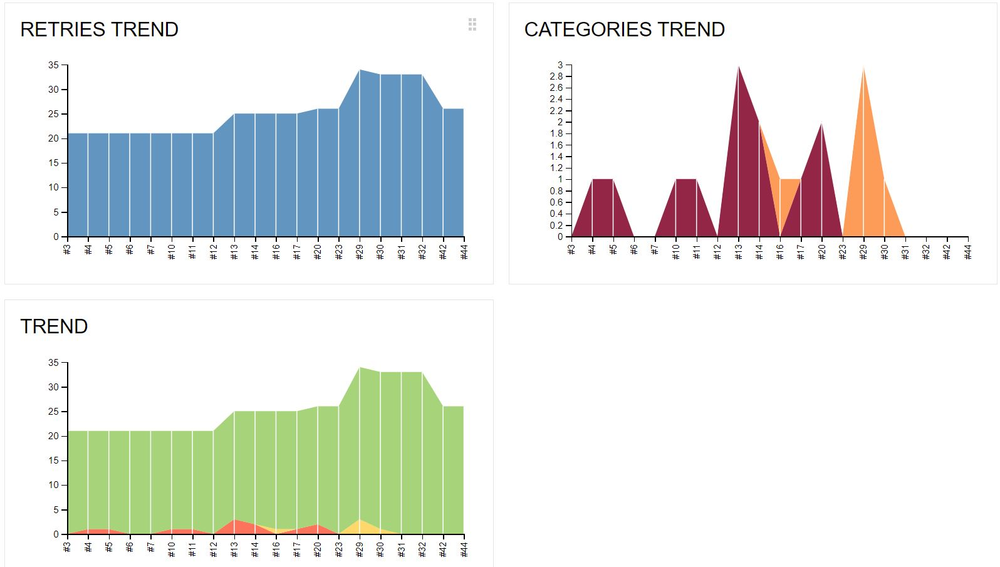
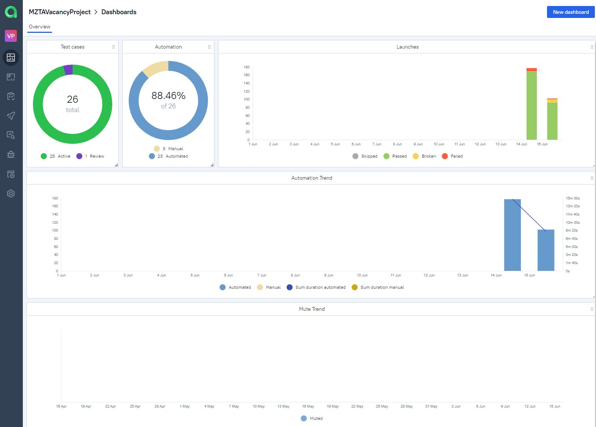
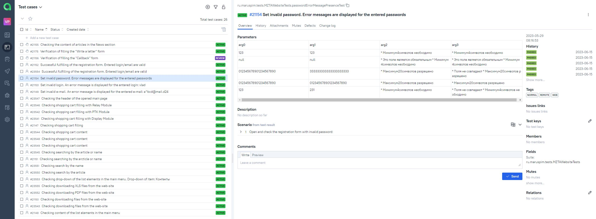
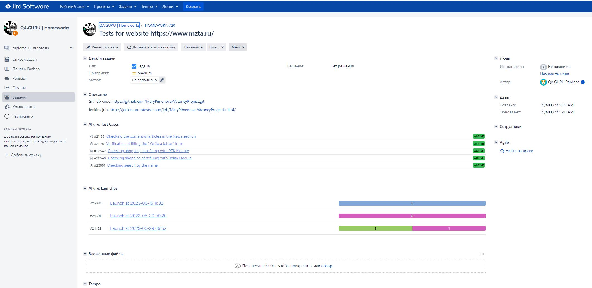

> <font color="#019901">Не следует заставлять тестировщиков тестировать быстрее. Что может быть хуже испуганных, усталых, цинично настроенных тестировщиков?</font>
# :woman_technologist:Test automation project for [Moscow Thermal Automation Plant (MZTA)](https://www.mzta.ru/) company.
> - MZTA is a Russian manufacturer of devices for managing technological processes and engineering systems
> - MZTA provides a full range of engineering services for the implementation of automation and dispatching systems
> - MZTA conducts regular training courses on the use of products manufactured by PTK Komega and PTK Kontar
## :pretzel: Table of contents
- [Tools and technologies](#hammer_and_wrench-tools-and-technologies)
- [List of implemented tests](#bookmark_tabs-list-of-implemented-tests)
- [Running autotests from the terminal](#desktop_computer-running-autotests-from-the-terminal)
- [Parameterized build in Jenkins](#-parameterized-build-in-jenkins)
- [Allure report](#-allure-report)
- [Integration with Jira](#-integration-with-jira)
- [Telegram notifications using a bot](#-telegram-notifications-using-a-bot)
- [Video example of running tests in Selenoid](#-video-example-of-running-tests-in-selenoid)

## :hammer_and_wrench: Tools and technologies

| IntelliJ IDEA | Java | Selenide | Selenoid  | Allure Report |  Allure TestOps | Gradle | JUnit5 | GitHub | Jenkins| Telegram | Jira |
|:---------:|:---------:|:---------:|:---------:|:---------:|:---------:|:---------:|:---------:|:---------:|:---------:|:---------:|:---------:|
|  |  |  |  | | | | | | |||
- To create autotests in this project the <code>[Java](https://www.java.com/)</code> language was used.
- <code>[Gradle](https://gradle.org/)</code> was used as an automatic build system.  
- Frameworks <code>[JUnit5](https://junit.org/junit5/)</code> and <code>[Selenide](https://selenide.org/)</code> for automated testing of web applications have been applied.
- Browsers were launched via <code>[Selenoid](https://aerokube.com/selenoid/)</code>.
- To run tests remotely a job was implemented in <code>[Jenkins](https://jenkins.autotests.cloud/job/MaryPimenova-VacancyProjectUnit14/)</code> with the creation of an <code>[Allure-report](https://jenkins.autotests.cloud/job/MaryPimenova-VacancyProjectUnit14/7/allure/)</code> and sending the results to <code>Telegram</code> using special Telegram bot.
- Integrations with с <code>[Allure TestOps](https://allure.autotests.cloud/project/2434/dashboards)</code> and <code>[Jira](https://jira.autotests.cloud/browse/HOMEWORK-720)</code> were implemented.

## :bookmark_tabs: List of implemented tests
#### ✓ List of realized automatic tests
- [x] Checking for the presence of the main menu items of the site
- [x] Checking drop-down of the list elements in the main menu
- [x] Checking for the presence of correct page titles when navigating through menu items
- [x] Checking shopping cart filling
- [x] Checking downloading files from the web-site
- [x] Checking searching for the production by its arcticle or name
- [x] Checking fulfilling of the registration form with valid/invalid data

#### ✓ List of realized manual tests
- [x] Verification of filling the "Callback" form
- [x] Verification of filling the "Write a letter" form
- [x] Сhecking the content of articles in the News section

## :desktop_computer: Running autotests from the terminal
Lauching tests on a ***remote server*** using Jenkins and Selenoid (login and password are required for authorization) can be done using the following command from the terminal:
```bash  
gradle clean remote
```
___
Running the following command in the IDE terminal will run the tests remotely in Selenoid taking into account the specified ***parameters***:
```bash  
gradle clean remote -Dbase_url=https://www.mzta.ru -Dselenoid_url=https://selenoid.autotests.cloud/wd/hub -Dselenoid_login_password=user1:1234  -Dbrowser=chrome:100.0 -Dbrowser_size=1920x1080
```
If you do not specify any parameters, then the test will run with the default values that we set above.

##  Parameterized build in Jenkins
#### Link to job in Jenkins
Using the link below you can go to the parameterized build of the project:

> :globe_with_meridians: <code>[Link to the job in Jenkins](https://jenkins.autotests.cloud/job/MaryPimenova-VacancyProjectUnit14/)</code>

#### Build options
The table below shows the build options in Jenkins, their purpose and default settings.

| **PARAMETER** | **DESCRIPTION** | **DEFAULT VALUE** |
|:---------:|:---------:|:---------:|
| <code>BASE_URL</code>| Base URL of the site for configuration settings|https://www.mzta.ru|
| <code>SELENOID_URL</code>| Selenoid URL for configuration settings|https://selenoid.autotests.cloud/wd/hub|
| <code>USER_LOGIN</code>| Login to the Selenoid account|	:lock:	:lock:	:lock:	:lock:|
| <code>USER_PASSWORD</code>| Password to the Selenoid account|	:lock:	:lock:	:lock:	:lock:|
| <code>BROWSER</code>| Browser type and its version|Chrome : 100.0|
| <code>BROWSER_SIZE</code>| Browser size |1920x1080|

#### Job in Jenkins: algorithm and autotests results
1. Open the project from the link above. The screenshot shows the appearance of the project window in Jenkins.
<p align="center">

</p>

2. Select the item "Collect with parameters" on the left panel

3. If necessary, change the parameters by selecting values from the drop-down lists

4. Click "Collect" button

5. The results of running a parameterized build can be viewed in <code>Allure report</code> and <code>Allure TestOps</code>
<p align="center">

</p>

##  Allure report
#### Link to Allure report
Using the link below you can go to the Allure report:

> :globe_with_meridians: <code>[Link to the  Allure report](https://jenkins.autotests.cloud/job/MaryPimenova-VacancyProjectUnit14/7/allure/)</code>

#### Allure report: overview
The screenshot below shows the main page of the report.
<p align="center">

</p>

#### Allure report: test cases
On the Suites tab a standard structural representation of executed tests can be found.
<p align="center">

</p>


#### Allure report: graphs
Graphs allow you to see different statistics collected from the test data: statuses breakdown or severity and duration diagrams.
<p align="center">

</p>
<p align="center">

</p>

##  Allure TestOps
#### Link to Allure TestOps
Using the link below you can go to the Allure TestOps:

> :globe_with_meridians: <code>[Link to the  Allure TestOps](https://allure.autotests.cloud/project/2434/dashboards)</code>

#### Allure TestOps: dashboard
Standard dashboard (see the picture below) provides instant insight on status of tests you're having in your project and resides in the Dashboards section of a project.
<p align="center">

</p>
The default dashboard contains:

1. Number of test cases and distribution per state (active, in review, outdated etc.)
2. Number of test cases and distribution between the manual tests and automated tests
3. Automation trend with the insight regarding the number of test during last 14 days
4. Information about launches and thier results status (failed, passed)
5. Mutes trend, i.e. the number of tests excluded from statistics due to permanent failed state or flaky state.

#### Allure TestOps: test cases
Allure TestOps supports working with both – manual and automated test cases. Steps of a test case are described in the scenario.

<p align="center">

</p>

#### Allure TestOps: manual tests
Manual test cases with scenario of execution are shown on the picture below.

<p align="center">

</p>

#### Allure TestOps: automated tests
Automated test cases are generated based on test results received from automated tests.

<p align="center">

</p>

##  Integration with Jira
#### Link to Jira
Using the link below you can go to the Jira:
> :globe_with_meridians: <code>[Link to the  Jira](https://jira.autotests.cloud/browse/HOMEWORK-720)</code>
<p align="center">

</p>

##  Telegram notifications using a bot
As a result of running autotests, a config.json file is generated in the notifications/ folder. On the basis of this file a notification is generated that the bot sends (a diagram is drawn and the corresponding text is added).


<p align="center">

</p>

*After the completion of the autotests for each of them screenshots, page source, browser console logs and a video recording of the test are available in the report.*

##  Video example of running tests in Selenoid
The test report is accompanied by a video in the Attachment section.
<p align="center">
  
</p>
